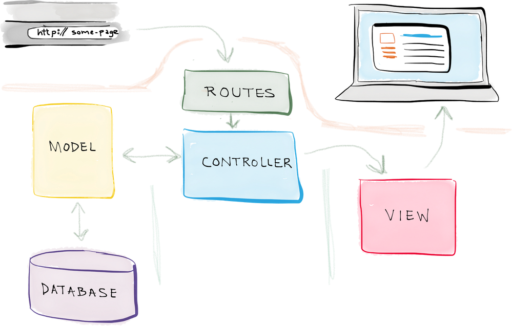

// - **POST /api/users** - Register a user
// - **POST /api/users/auth** - Authenticate a user
// - **POST /api/users/logout** - Logout a user and clear cookies 
// - **GET /api/users/profile** - get a user profile
// - **PUT /api/users/profile** - Update a user profile

 * HTTP Methods
    GET - to take some data on server
    POST - to add some data on server
    PUT - to update some data on server
    DELETE - Del
    PATCH - Partially update
 

 ### Route - Is the url or path ('api/user..') where we send request / Controller - Brain of your route which process req / Models - DB

